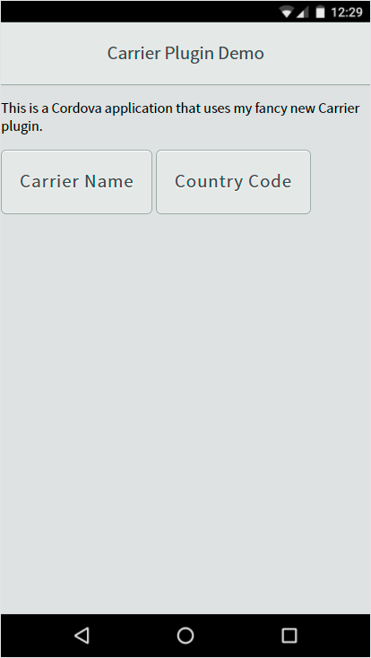

# Carrier Plugin Test Application

The Apache Cordova application source found in this folder contains a simple application used to exercise my [Carrier](https://www.npmjs.com/package/johnwargo-cordova-plugin-carrier) plugin. The application renders a simple page with two buttons, one button calls the plugin method to retrieve the wireless carrier for the device, and the other retrieves the country code where the device is operating.

