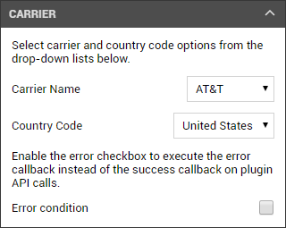

# PhoneGap Day 2017

This repository contains the source code for my PhoneGap Day 2017 presentation. The repository includes the sample Apache Cordova app source as well as the plugin source code files needed to demonstrate how to add support for [Cordova Simulate](https://github.com/Microsoft/cordova-simulate) to your custom Cordova plugins.

In this case, I'm demonstrating how I've enhanced my existing [Carrier](https://www.npmjs.com/package/johnwargo-cordova-plugin-carrier) plugin with the Cordova Simulate panel shown below.

